# Git笔记 {ignore=true}

官方文档：[https://git-scm.com/book/zh/v2](https://git-scm.com/book/zh/v2)
***
<!-- @import "[TOC]" {cmd="toc" depthFrom=1 depthTo=6 orderedList=false} -->
<!-- code_chunk_output -->

- [1. 在Windows上安装Git](#1-在windows上安装git)
- [2. 初次运行 Git 前的配置](#2-初次运行-git-前的配置)
  - [2.1 查看所有的配置以及它们所在的文件](#21-查看所有的配置以及它们所在的文件)
  - [2.2 列出所有 Git 当时能找到的配置](#22-列出所有-git-当时能找到的配置)
  - [2.3 检查 Git 的某一项配置](#23-检查-git-的某一项配置)
  - [2.4 配置用户名和邮件地址](#24-配置用户名和邮件地址)
- [3. Git命令总结](#3-git命令总结)
  - [3.1 Git对一个目录进行版本控制的步骤](#31-git对一个目录进行版本控制的步骤)
  - [3.2 分支](#32-分支)
  - [3.3 基于GitHub做代码托管](#33-基于github做代码托管)
  - [3.4 rebase变基](#34-rebase变基)
  - [3.5 打标签](#35-打标签)
  - [3.6 快速解决冲突](#36-快速解决冲突)
- [4. 新建GitHub仓库](#4-新建github仓库)
- [5. HTTPS和SSH的区别](#5-https和ssh的区别)
- [6. 生成SSH公钥并添加到GitHub](#6-生成ssh公钥并添加到github)
  - [6.1 Gitee](#61-gitee)
  - [6.2 GitHub](#62-github)
    - [将SSH密钥添加到GitHub账户](#将ssh密钥添加到github账户)
- [7. git免密登录](#7-git免密登录)

<!-- /code_chunk_output -->
***

## 1. 在Windows上安装Git

官网安装地址：[https://git-scm.com/download/win](https://git-scm.com/download/win)
其他安装位置：[https://gitforwindows.org/](https://gitforwindows.org/)
git-scm 是 Git 的官方，里面有不同系统不同平台的安装包和源代码[但是比较慢]，而 gitforwindows.org 里只有 windows 系统的安装包
安装教程：[https://blog.csdn.net/mukes/article/details/115693833?spm=1001.2014.3001.5506](https://blog.csdn.net/mukes/article/details/115693833?spm=1001.2014.3001.5506)
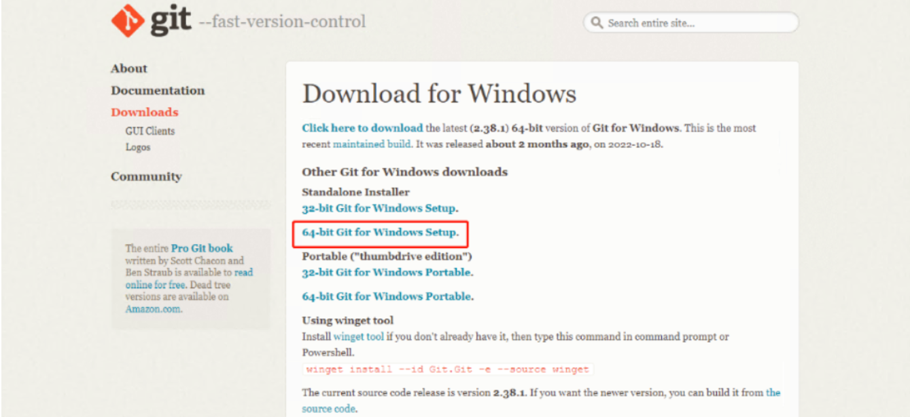
所有的安装过程都可以直接点击next，便可以顺利完成。
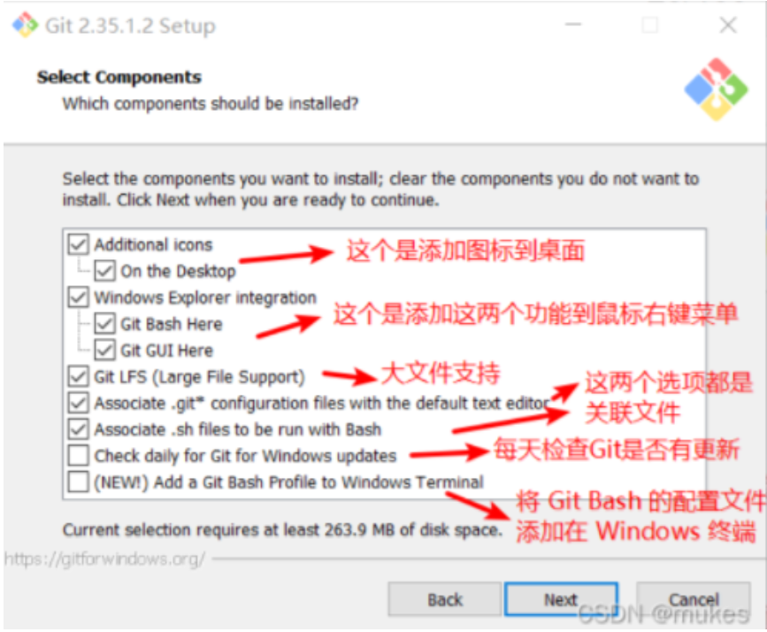  
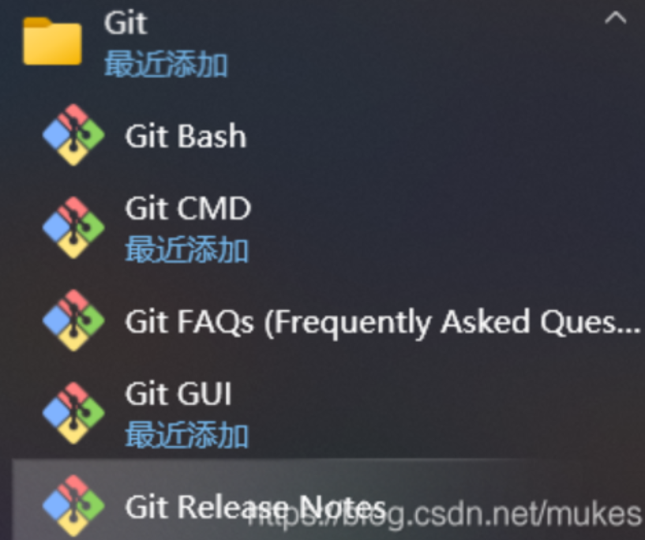

## 2. 初次运行 Git 前的配置

### 2.1 查看所有的配置以及它们所在的文件

命令：`git config --list --show-origin`
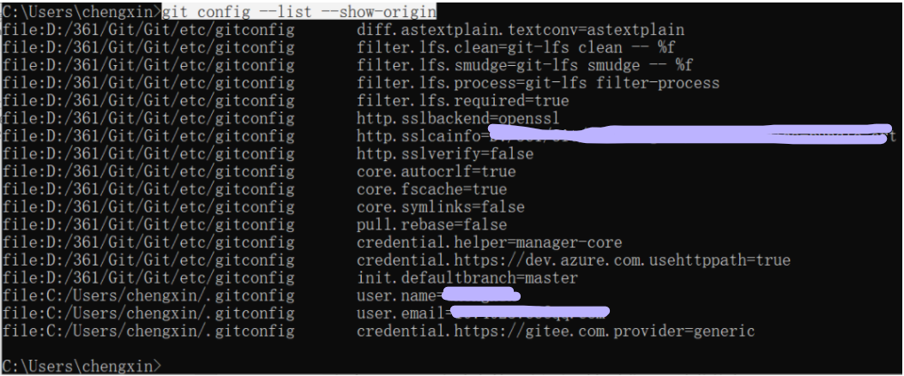

### 2.2 列出所有 Git 当时能找到的配置

命令：`git config --list`
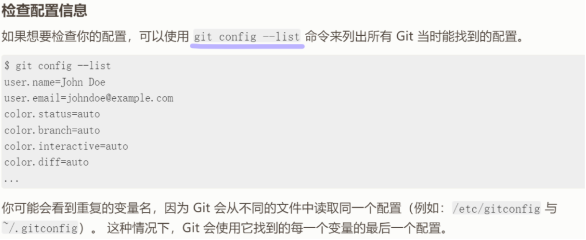

### 2.3 检查 Git 的某一项配置

命令：`git config <key>`
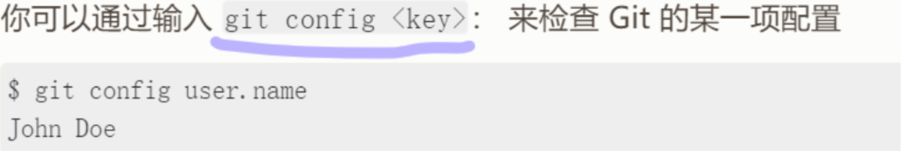

### 2.4 配置用户名和邮件地址

安装完 Git 之后，要做的第一件事就是设置你的用户名和邮件地址。(--global表示全局配置，配置文件存储在C:\Users\你的用户名\.gitconfig，若是--local则表示配置当前项目，配置文件存储在/.git/config)
`git config --global user.name "用户名"`
`git config --global user.email "邮箱"`
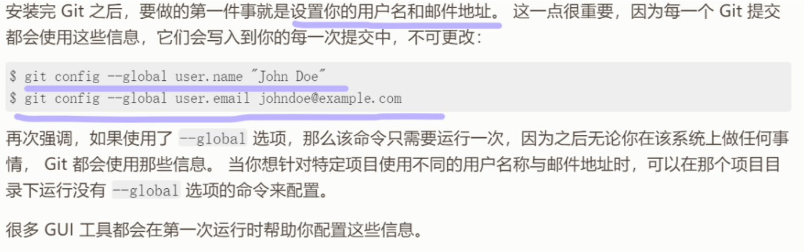
【尽量将git客户端的用户名、邮箱和github账号的用户名、邮箱设置为完全一致】
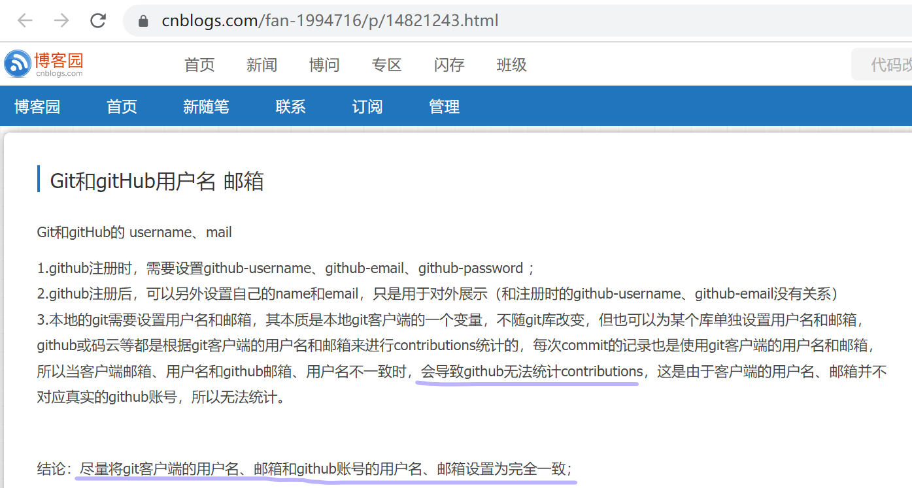

## 3. Git命令总结

Git的三大区域：
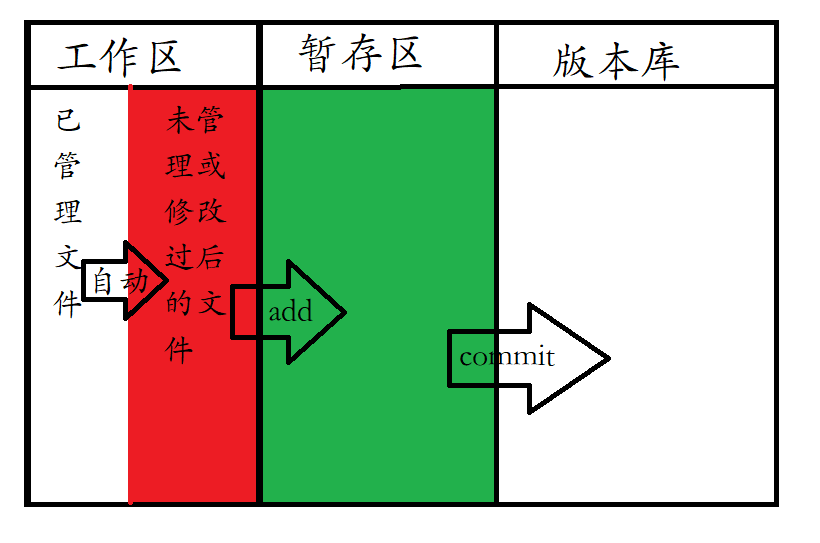

### 3.1 Git对一个目录进行版本控制的步骤

1. 加入要管理的文件夹
2. 鼠标右键选择Git Bash Here，执行初始化命令
`git init`
3. 管理目录下的文件状态
`git status`
注：新增的文件和修改过后的文件都是绿色
缩短状态命令的输出：`git status -s`或`git status --short`
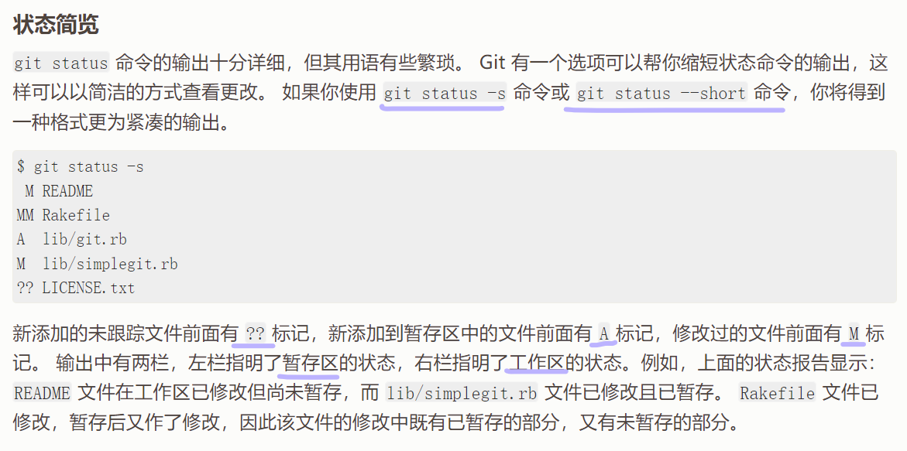

4. 管理制定文件
`git add 文件名`
`git add .`
“.”表示所有文件
5. 个人信息配置：用户名、邮箱【若配置过了就不要再配置了】
`git config --global user.name "用户名"`
`git config --global user.email "邮箱"`
6. 生成版本
`git commit -m "描述信息"`
7. 查看版本记录
`git log`
8. 回滚到之前版本
`git log`
`git reset --hard 版本号`
9. 回滚到上次回滚之前的版本
`git reflog`
`git reset --hard 版本号`
10. 忘记了暂存某些需要的修改，可以像下面这样操作:
`git commit -m 'initial commit'`
`git add forgotten_file`
`git commit --amend`
最终你只会有一个提交——第二次提交将代替第一次提交的结果。

### 3.2 分支

><font Size=4>分支工作原理图：</font>
>
>- 主分支开发了C1、C2(只保存在C1的基础上新增的部分代码)、C3版本，
>- 创建dev分支开发新功能，开发到一半，线上部分出现bug，需紧急修复bug，
>- 此时需把dev分支工作区的现有代码提交到暂存区，形成C4版本，
>- 再切换到master主分支，此时工作区代码回到C3版本，
>- 创建并切换到bug分支，进行紧急bug修复，修复好后提交代码形成C5版本，
>- 切换到master分支，将bug分支的代码合并到master分支，
>- 此时master分支上的代码变成了C5版本(比C3多了修复bug的代码)，
>- 此时bug分支已经没有意义了，将其删除，
>- 切换到dev分支继续继续新功能的开发，新功能开发完成，提交后形成C6版本，
>- 切换到master分支，将dev分支合并到master分支，形成C7版本(即有修复bug又有新功能)
>
>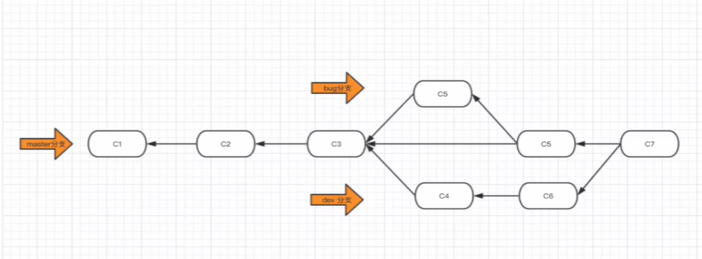

1. 查看分支
`git branch`
2. 创建分支
`git branch 分支名称`
3. 切换分支
`git checkout 分支名称`
4. 创建并切换分支(2、3合并)
`git checkout -b 分支名称`
5. 分支合并（可能产生冲突）
`git merge 要合并的分支`
注意：切换分支再合并
6. 删除分支
`git branch -d 分支名称`
7. 修改本地分支名字
`git branch -m 旧名字 新名字`

Git最简单的==工作流==：
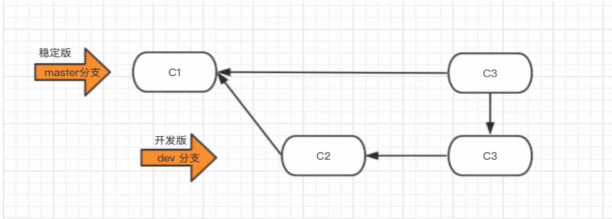

### 3.3 基于GitHub做代码托管

首先要在GitHub上创建一个与我们工作区的项目名称一致的仓库。（[新建GitHub仓库步骤见4.新建GitHub仓库](#4-新建github仓库)）然后，将本地项目代码推送到仓库。推送步骤入下：

1. 给远程仓库起别名
`git remote add origin 远程仓库地址`
2. 向远程仓库推送代码
`git push -u origin 分支`
3. 查看当前所有进程地址别名
`git remote -v`
4. 仓库中创建了readme.md文件会出现的问题
若远程仓库中创建了readme.md文件，此时执行git push会失败

远程仓库中有readme.md文件，需先拉取代码到本地再push，第一次pull也报错了，拒绝合并，需在命令后加上`--allow-unrelated-histories`进行允许合并，这样就pull成功了：
`git pull origin master --allow-unrelated-histories`

pull之后再进行push就成功了：


若要在另一台电脑上进行开发，则可将远程仓库代码克隆到本地进行开发：

1. 克隆远程仓库代码
`git clone 远程仓库地址`(内部已经实现了`git remote add origin 远程仓库地址`)
2. 切换分支
`git checkout dev`(将远程仓库克隆到本地后用`git branc`查看分支只看到master分支，而远程仓库上是有dev分支的，我们可直接切换到远程仓库已有的分支上)
3. ==把master分支合并到dev==【执行一次即可，因为之前dev分支合并到master分支，master分支上形成了C7版本，而dev分支上还是C6版本】
`git merge master`
4. 进行开发
5. 提交代码
`git add .`
`git commit -m 'xxxx'`
`git push origin dev`

在新电脑上开发后，再次回到原来的电脑上开发：

1. 切换到dev分支
`git checkout dev`
2. 拉取代码
`git pull origin dev`(将在远程仓库上的代码更新到本地)
3. 继续开发
4. 提交代码
`git add .`
`git commit -m 'xxxx'`
`git push origin dev`

开发完毕，要上线：

1. 将dev分支合并到master分支，进行上线
`git checkout master`
`git merge dev`
`git push origin master`
2. 把dev分支也推送到远程
`git checkout dev`
`git merge master`
`git push origin dev`

git和远程仓库工作图：
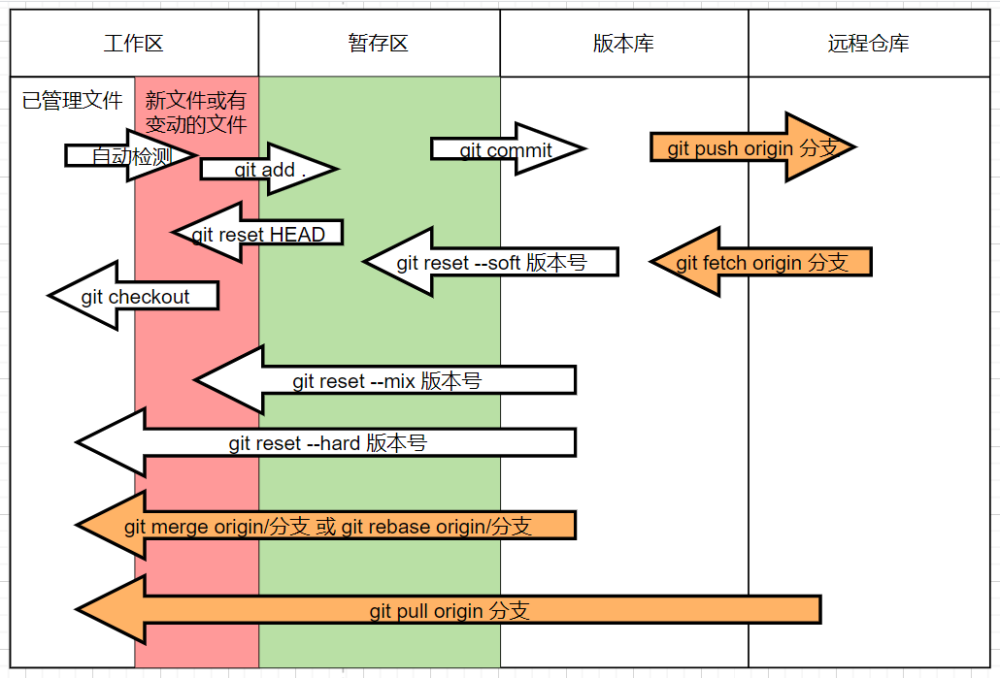
`git pull origin dev`相当于`git fetch origin dev`加上`git merge origin/dev`
撤消之前所做的修改：`git checkout -- <file>`是一个危险的命令。 你对那个文件在本地的任何修改都会消失——Git 会用最近提交的版本覆盖掉它。 除非你确实清楚不想要对那个文件的本地修改了，否则请不要使用这个命令。
取消暂存：`git reset HEAD <file>`使file变成修改未暂存的状态。

### 3.4 rebase变基

可以保持代码提交记录整洁
`git rebase -i HEAD~3`（HEAD~3表示从当前分支开始找最近的3条记录）
`git rebase -i 版本号`
`git rebase 分支`
记录图形展示(%h表示哈希值，%s表示提交记录的描述)
`git log --graph --pretty=format:"%h %s"`
rebase过程中可能会产生冲突：
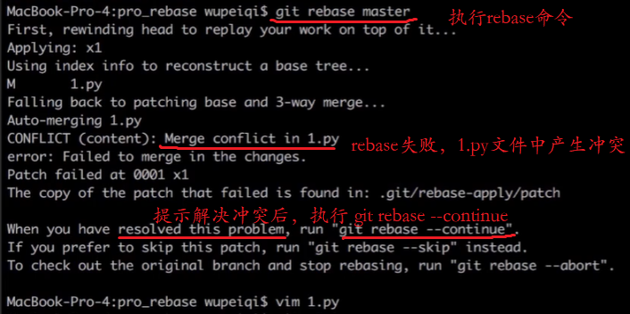
解决完冲突后，执行`git add .`将解决完冲突的文件加上，再执行`git rebase --continue`继续进行rebase
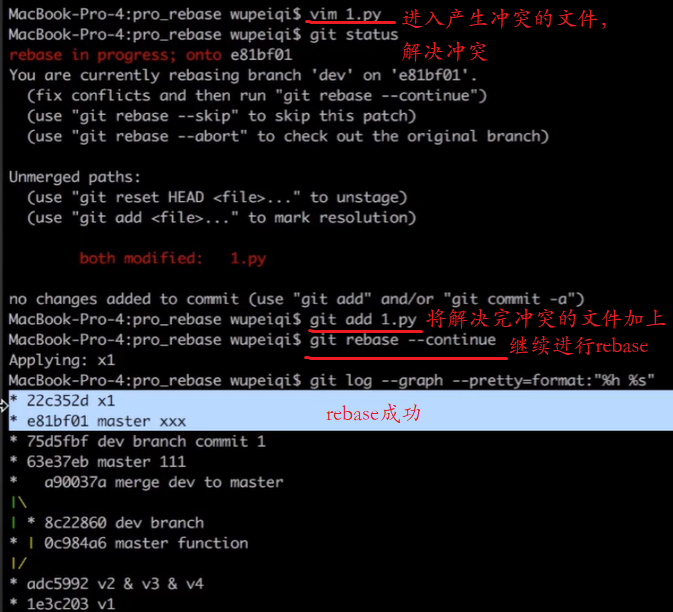

1. rebase应用场景一
创建项目pro_rebase，进入项目进行初始化，开始开发，进行了4次提交代码，将前3次提交记录合并，使提交记录更加简洁，演示入下：
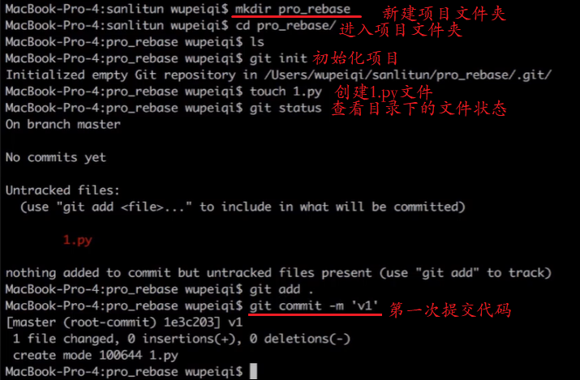
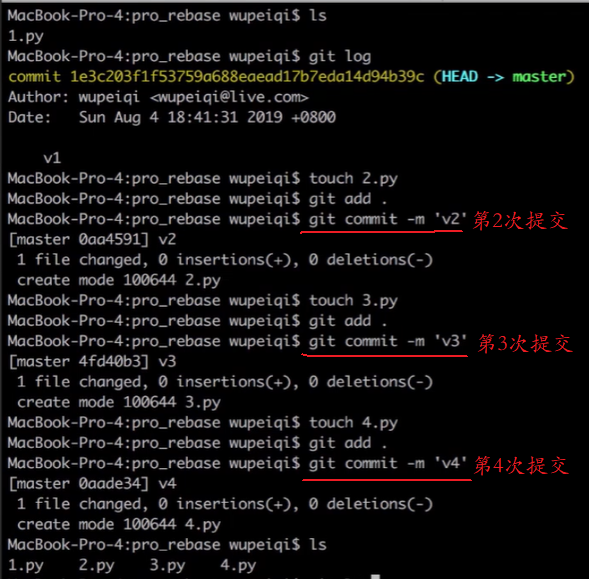
查看rebase前的提交记录，通过`git rebase -i HEAD~3`（HEAD~3表示从当前分支开始找最近的3条记录）或`git rebase -i 版本号`进行rebase
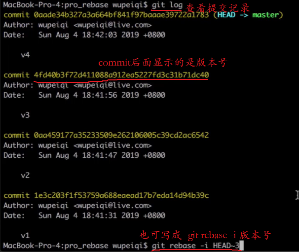
修改提交描述：
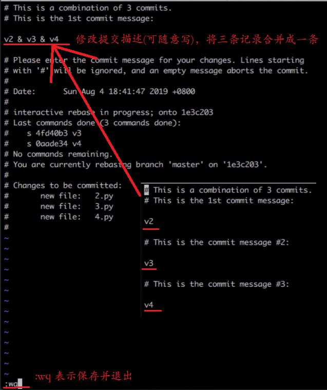
rebase结果显示：
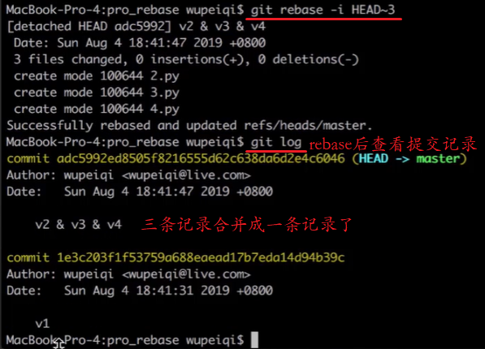
==注意：合并记录时，建议不要合并已push到远程仓库的记录==

2. rebase应用场景二
场景：dev分支合并到master分支后，想把dev分支的记录合并到master分支中

演示：
创建并切换到dev分支进行开发后提交代码
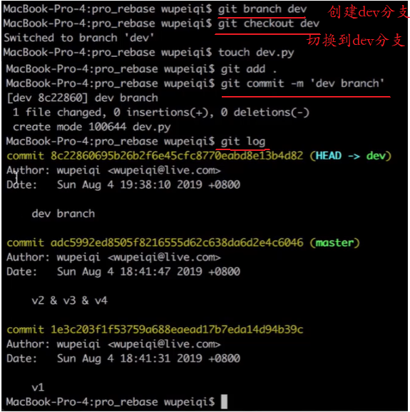
切换到master分支进行开发后提交代码
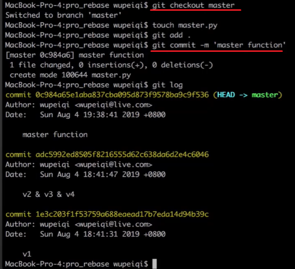
在master分支上通过`git merge dev`将dev分支合并到master分支，形成合并记录
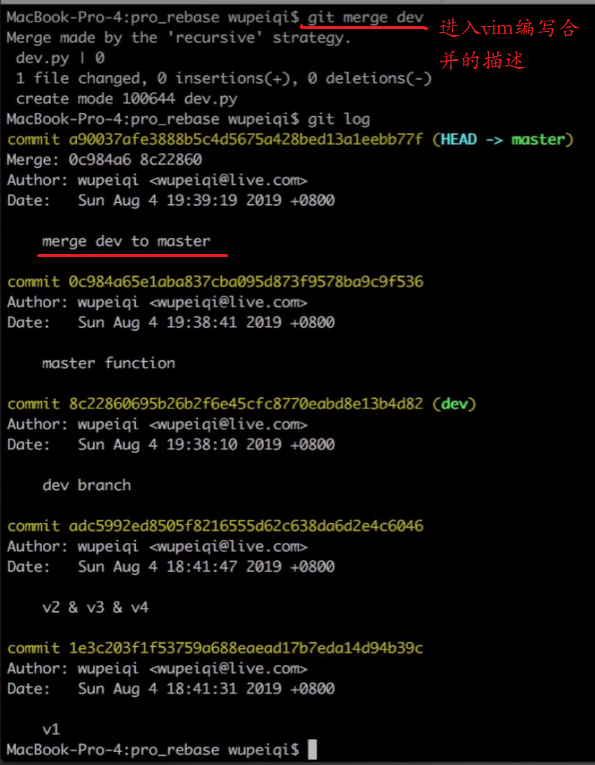
使用`git log --graph`查看以图形方式展示的提交记录
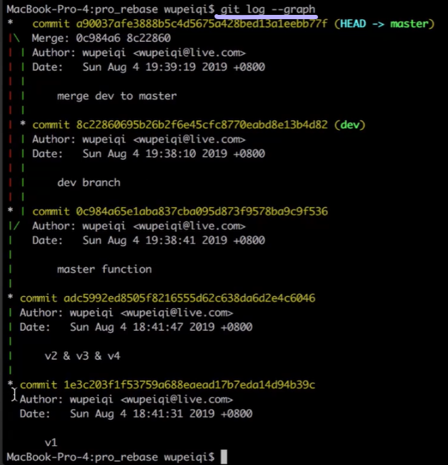
以图形方式显示的时候格式化一下，%h表示哈希值，%s表示提交记录的描述`git log --graph=format:"%h %s"`，可以看到记录上有dev的分叉
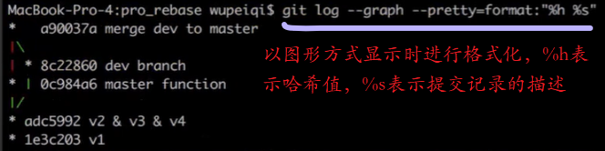
切换到dev分支继续进行开发，提交后再切换到master继续进行开发后提交
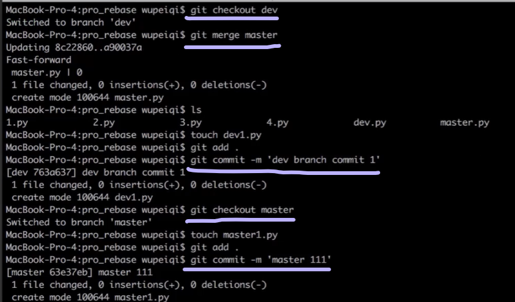
切换到dev分支，执行rebase命令`git rebase master`，把dev分支变成主干分支，把master中的代码放大dev中，再切回master，把dev合并到master
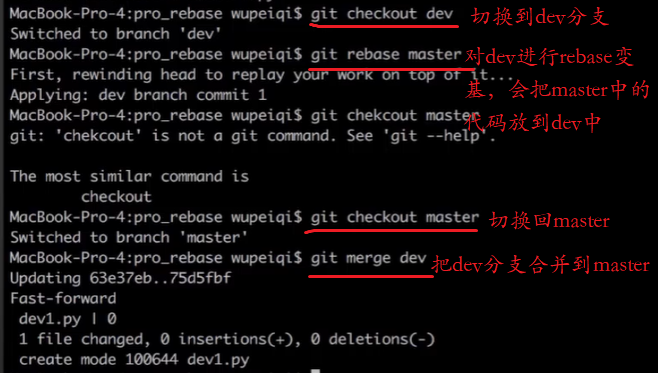
以图形方式查看记录`git log --graph=format:"%h %s"`，可以看到后面进行了rebase操作的部分记录合并到主分支了，没有分叉
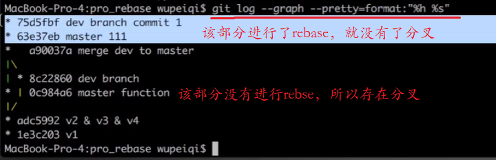

### 3.5 打标签

Git 支持两种标签：==轻量标签==（lightweight）与==附注标签==（annotated）。
**轻量标签**很像一个不会改变的分支——它只是某个特定提交的引用。
而**附注标签**是存储在 Git 数据库中的一个完整对象， 它们是可以被校验的，其中包含打标签者的名字、电子邮件地址、日期时间， 此外还有一个标签信息，并且可以使用 GNU Privacy Guard （GPG）签名并验证。 通常会建议创建附注标签，这样你可以拥有以上所有信息。但是如果你只是想用一个临时的标签， 或者因为某些原因不想要保存这些信息，那么也可以用轻量标签。

1. 列出标签
`git tag`
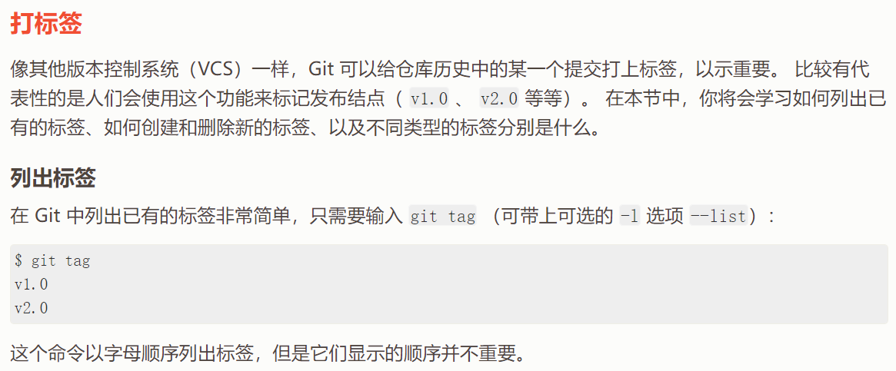

2. 通配模式一定要有`-l`或`-list`
`git tag -l "v1.8.5*"`
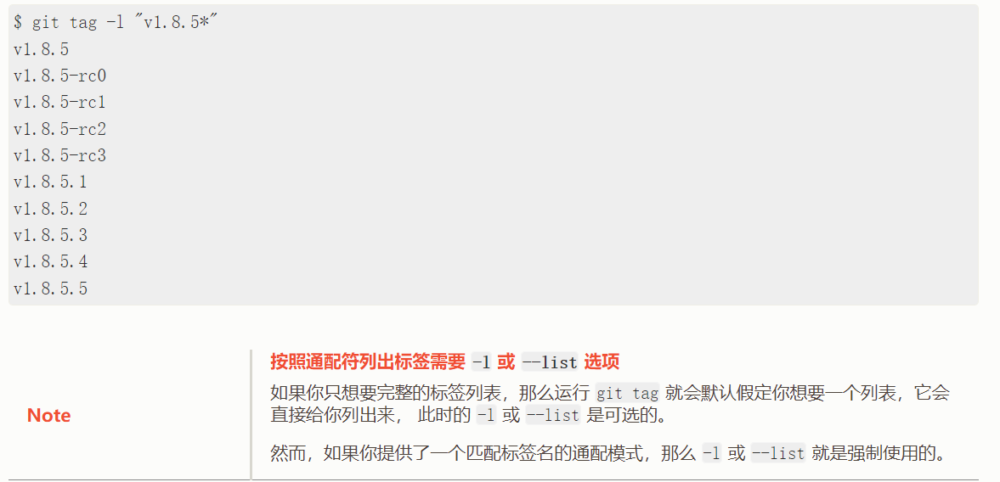

3. 附注标签
（-m 选项指定了一条将会存储在标签中的信息。 如果没有为附注标签指定一条信息，Git 会启动编辑器要求你输入信息。）
`git tag -a 标签名 -m "标签描述"`
通过使用 `git show 标签名` 命令可以看到标签信息和与之对应的提交信息
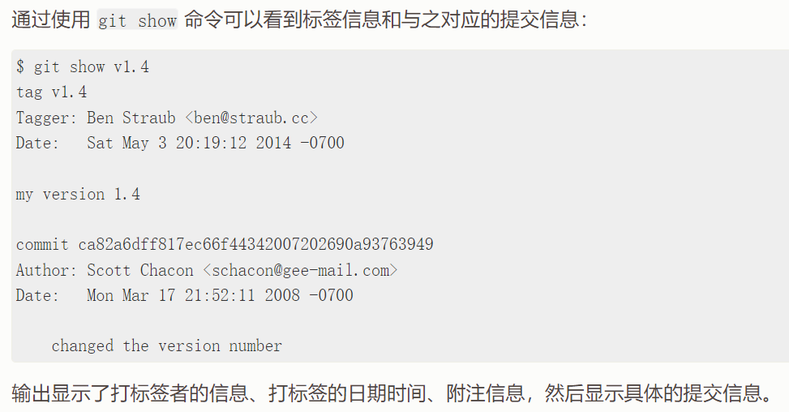

4. 轻量标签
`git tag "标签名"`

5. 后期打标签
`git tag -a 标签名 提交的校验和或部分校验和`
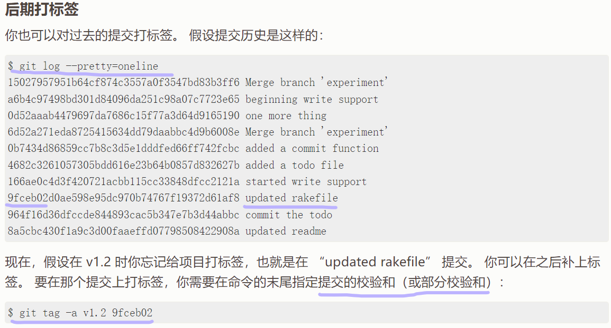

6. 共享标签
默认情况下，git push 命令并不会传送标签到远程仓库服务器上。 在创建完标签后你必须显式地推送标签到共享服务器上。 这个过程就像共享远程分支一样——你可以运行 `git push origin <tagname>`。
如果想要一次性推送很多标签，也可以使用带有 `--tags` 选项的`git push origin --tags`命令。 这将会把所有不在远程仓库服务器上的标签全部传送到那里。
现在，当其他人从仓库中克隆或拉取，他们也能得到你的那些标签。

7. 删除标签
要删除掉你本地仓库上的标签，可以使用命令 `git tag -d <tagname>`
删除远程仓库的标签：
`git push origin :refs/tags/<tagname>`
`git push origin --delete <tagname>`
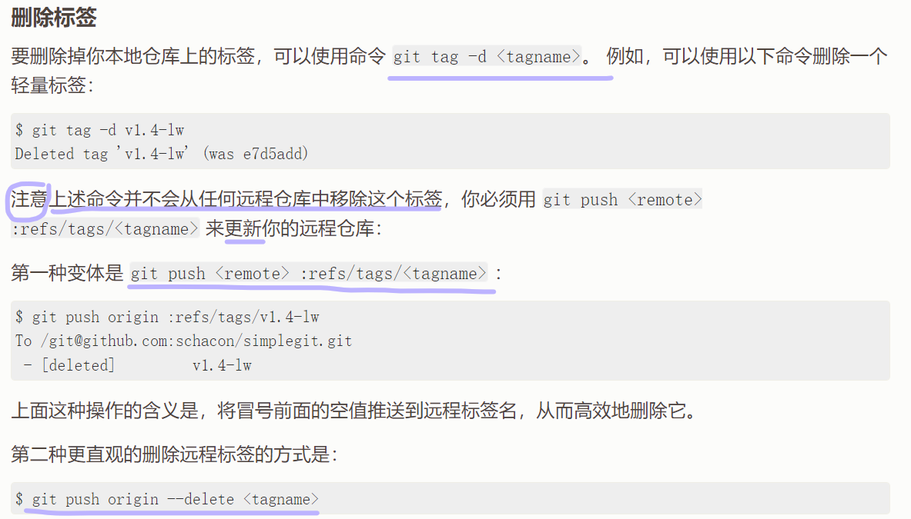

### 3.6 快速解决冲突

1. 安装图形化工具beyond compare
2. 在git中进行配置
`git config --local merge.tool bc3`(--local表示只在当前项目有效)
`git config --local mergertool.path '工具路径'`
`git config --local mergertool.keepBackup false`
3. 应用beyond compare解决冲突
`git mergertool`

## 4. 新建GitHub仓库

在GitHub中点击头像旁边的“+”，选择New repository新建仓库
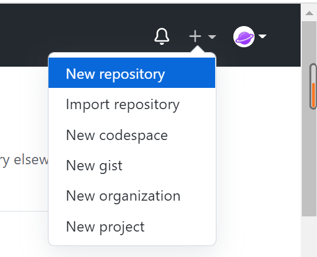
进入新建仓库页面，填写仓库相关信息：

```text
1. 填写仓库名称和描述
2. 选择public公开，必须的，防止访问不到
3. 添加一个READM文件，防止仓库没有主干分支
```

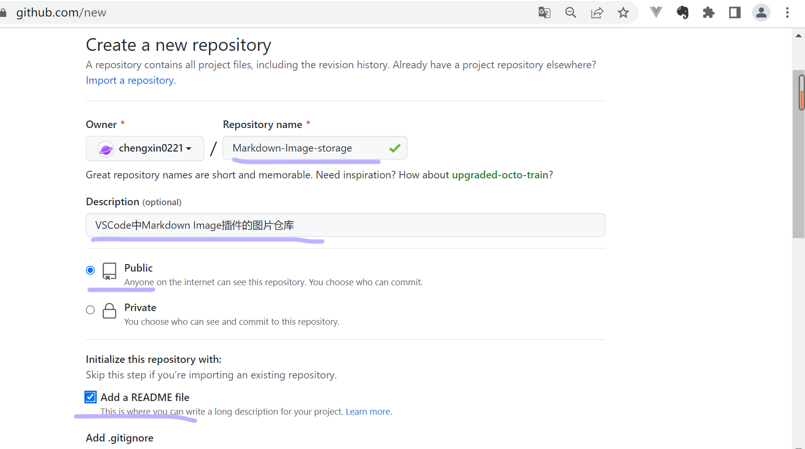

新建仓库成功
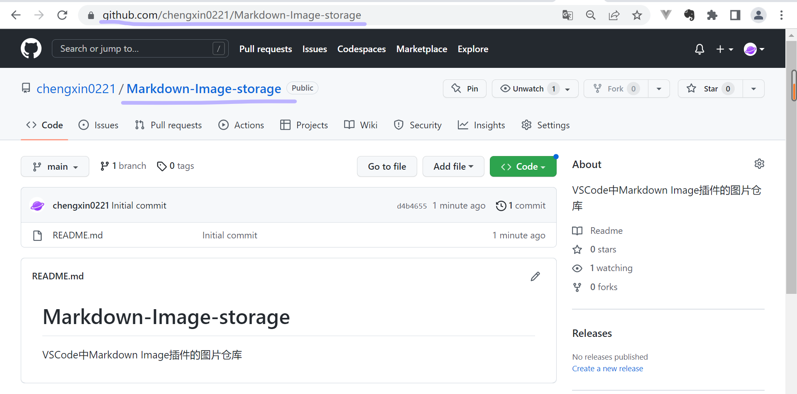
第一次新建仓库成功后，会看到Code上有一个绿点，选择SSH会出现提示：
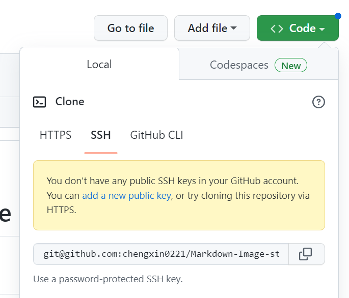
此时可点击`add a new public key`去生成密钥[步骤见6.生成SSH公钥并添加到GitHub](#6-生成ssh公钥并添加到github)

## 5. HTTPS和SSH的区别

引用自疲惫的豆豆的博客：[https://www.cnblogs.com/dzblog/p/6930147.html](https://www.cnblogs.com/dzblog/p/6930147.html)

1. **HTTPS**：使用https url克隆对初学者来说会比较方便，复制https url然后到git Bash里面直接用clone命令克隆到本地就好了，但是每次fetch和push代码都需要输入账号和密码，这也是https方式的麻烦之处([发现了https免密登录的方式](https://www.jianshu.com/p/b5ec092fc1d1))。
2. **SSH**：使用SSH url克隆却需要在克隆之前先配置和添加好SSH key，因此，如果你想要使用SSH url克隆的话，你必须是这个项目的拥有者或管理员，否则你是无法添加SSH key的。另外ssh默认是每次fetch和push代码都不需要输入账号和密码，如果配置SSH key的时候设置了密码，则需要输入密码的，否则直接是不需要输入密码的。

## 6. 生成SSH公钥并添加到GitHub

首先，需要确认自己是否已经拥有密钥。
默认情况下，用户的 SSH 密钥存储在`C:\Users\我的用户名\.ssh`目录下的`id_rsa.pub`文件中。

### 6.1 Gitee

若未有SSH密钥，需在Git Bash中输入：`ssh-keygen -t rsa -C "你的邮箱"`
这将以提供的电子邮件地址为标签创建新 SSH 密钥。
回车后出现：

```text
Generation public/private rsa key pair.
Enter file in which to save the key(/C/Users/你的用户名/.ssh/id_rsa):
```

直接点回车，说明会在默认文件id_rsa上生成ssh key。
然后系统要求输入密码，直接按回车表示不设密码。
重复密码时也是直接回车，之后提示你的shh key已经生成成功。
`C:\Users\你的用户名\.ssh`中出现`id_rsa`文件，打开`id_rsa.pub`文件，复制里面的内容，不要复制多余的空格，粘贴到gitee的SSH公钥处。
点击头像 ---》找到资料编辑
---》SSH公钥 ---》粘贴到公钥，标题为邮箱
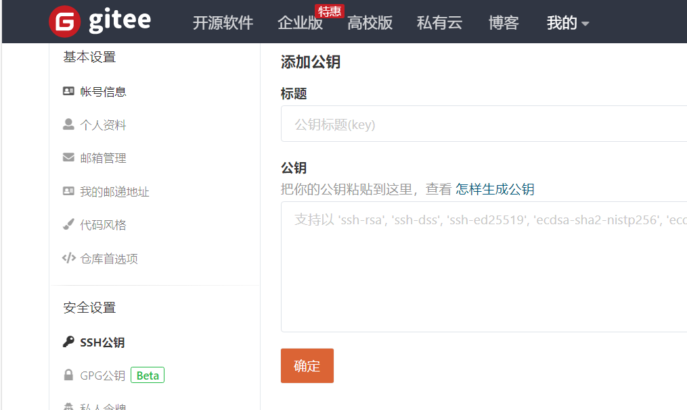

### 6.2 GitHub

官网：[生成新的SSH密钥](https://docs.github.com/zh/authentication/connecting-to-github-with-ssh/generating-a-new-ssh-key-and-adding-it-to-the-ssh-agent)
首先，需要确认自己是否已经拥有密钥。
默认情况下，用户的 SSH 密钥存储在`C:\Users\你的用户名\.ssh`目录下的`id_rsa.pub`文件中。
若未有密钥，则需在`Git Bash`中输入：`ssh-keygen -t rsa -C "你的邮箱"`
这将以提供的电子邮件地址为标签创建新 SSH 密钥。
回车后出现：

```text
Generation public/private rsa key pair.
Enter file in which to save the key(/C/Users/你的用户名/.ssh/id_rsa):
```

直接点回车，说明会在默认文件id_rsa上生成ssh key。
然后系统要求输入密码，直接按回车表示不设密码。
重复密码时也是直接回车，之后提示你的shh key已经生成成功。
`C:\Users\你的用户名\.ssh`中出现`id_rsa`文件，打开`id_rsa.pub`文件，里面的内容就是SSH Key。

#### 将SSH密钥添加到GitHub账户

点击Settings加入设置页面，再选择`SSH and GPG keys`单击`New SSH key`。将生成的SSH key粘贴到Key中，"Title"（标题）字段中，为新密钥添加描述性标签，我写了我的邮箱
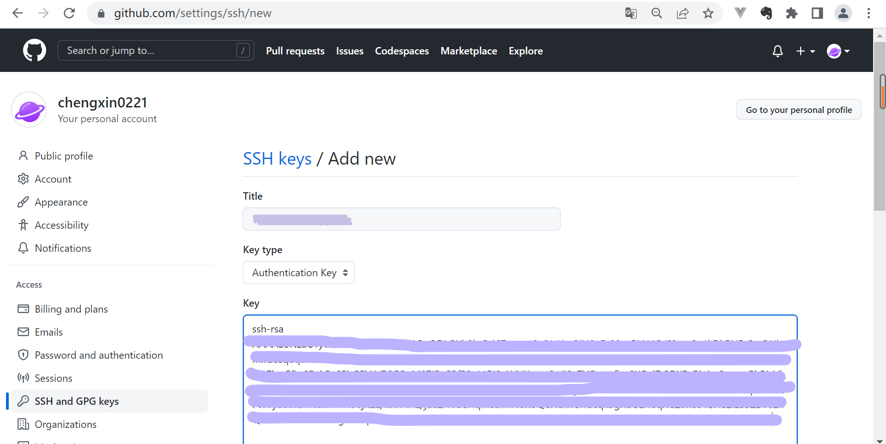
点击Add SSH key后添加成功：
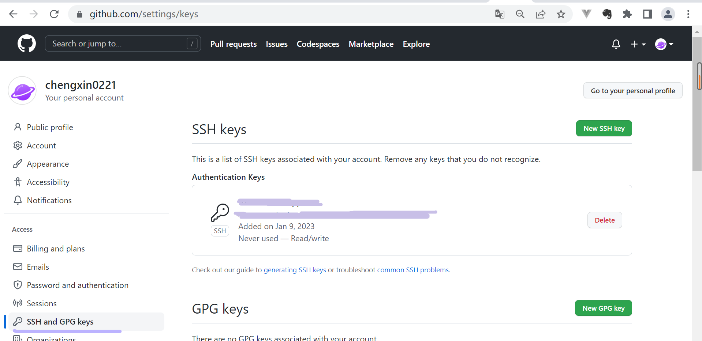

## 7. git免密登录

- URL中体现

```text
原来的地址：https://github.com/GitHub账户/仓库名.gt
修改的地址：https://用户名:密码@github.com/GitHub账户/仓库名.git

git remote add origin https://用户名:密码@github.com/GitHub账户/仓库名.git
git push origin master
```

避免每次输入密码：`git config --global credential.helper cache` [凭证存储](https://git-scm.com/book/zh/v2/Git-%E5%B7%A5%E5%85%B7-%E5%87%AD%E8%AF%81%E5%AD%98%E5%82%A8#_credential_caching)
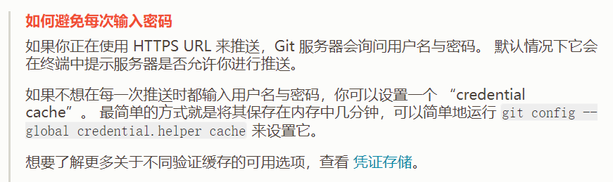

- SSH实现

```text
1. 生成公钥和私钥（默认放在C:\Users\你的用户名\.ssh目录下，id_rsa.pub公钥、id_rsa私钥）
直接执行ssh-keygen或ssh-keygen -t rsa -C "你的邮箱"
2. 拷贝公钥内容，并设置到GitHub中
3. 在git本地中配置ssh地址
git remote add origin git@github.com:GitHub账户/仓库名.git
4. 以后使用
git push origin master
```

- git自动管理凭证
