# **Markdown Image 插件配置图床**

***
<font Size=5>目录：</font>
<!-- @import "[TOC]" {cmd="toc" depthFrom=1 depthTo=6 orderedList=false} -->
<!-- code_chunk_output -->

- [**Markdown Image 插件配置图床**](#markdown-image-插件配置图床)
  - [1. 插件说明](#1-插件说明)
  - [2. 默认配置](#2-默认配置)
  - [3. GitHub仓库配置](#3-github仓库配置)
    - [3.1 新建仓库](#31-新建仓库)
    - [3.2 生成token](#32-生成token)
    - [3.3 GitHub配置项目](#33-github配置项目)

<!-- /code_chunk_output -->
***

## 1. 插件说明

官网：[https://github.com/imlinhanchao/vsc-markdown-image/blob/HEAD/README.zh-cn.md](https://github.com/imlinhanchao/vsc-markdown-image/blob/HEAD/README.zh-cn.md)
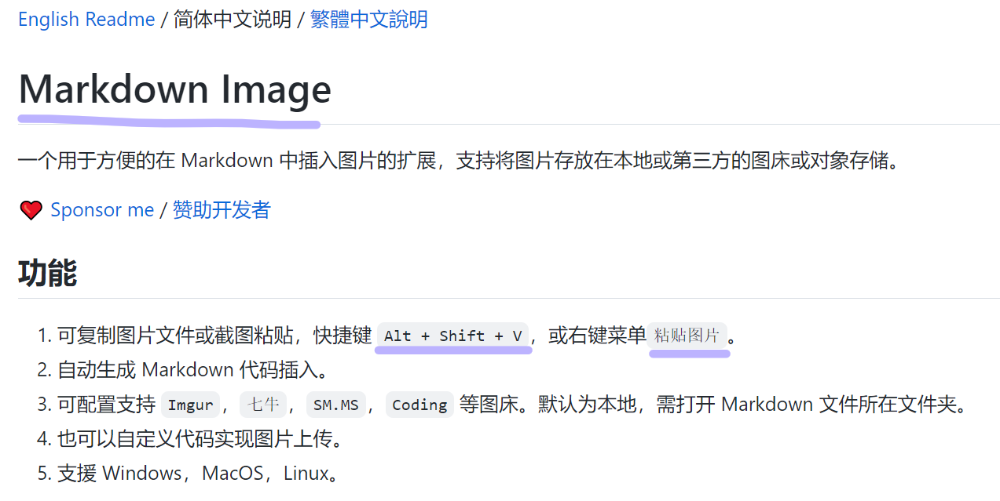

## 2. 默认配置

打开配置 ---》 输入 Markdown Image 即可看到该插件的配置：
**Markdown Image插件**默认的图片上传方式是上传到**本地**
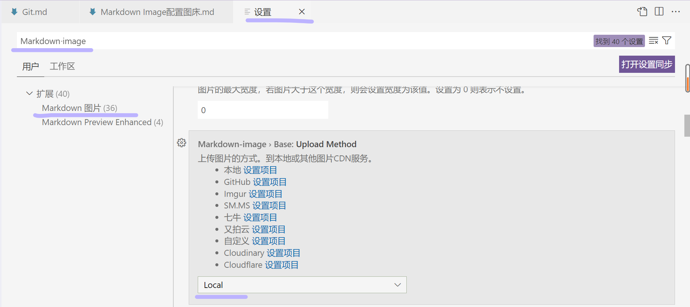
选择将图片上传到本地后，可在==Markdown-image.local.path==配置项上配置上传的相对路径
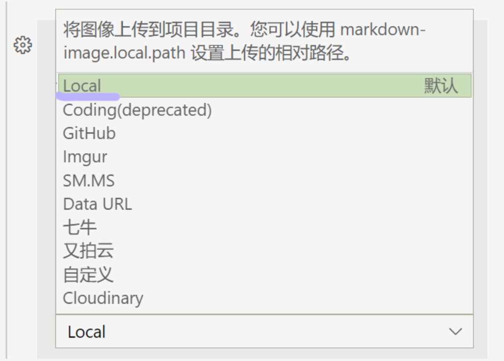
在==Markdown-image>Local: Path==配置项中填入相对路径，之后在.md文件中`Shift+Alt+V`粘贴的图片会上传到该目录下
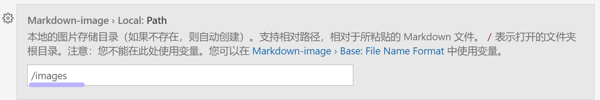

## 3. GitHub仓库配置

若选择 `GitHub` 图片上传方式，则需要在GitHub上新建一个仓库作为图床。

### 3.1 新建仓库

在GitHub中点击头像旁边的“+”，选择New repository新建仓库
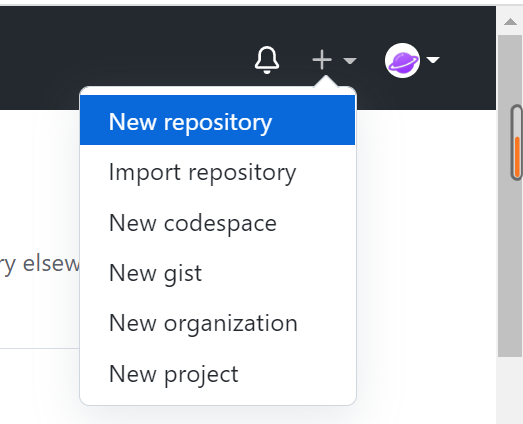
进入新建仓库页面，填写仓库相关信息：

```text
1. 填写仓库名称和描述
2. 选择public公开，必须的，防止访问不到
3. 添加一个READM文件，防止仓库没有主干分支
```

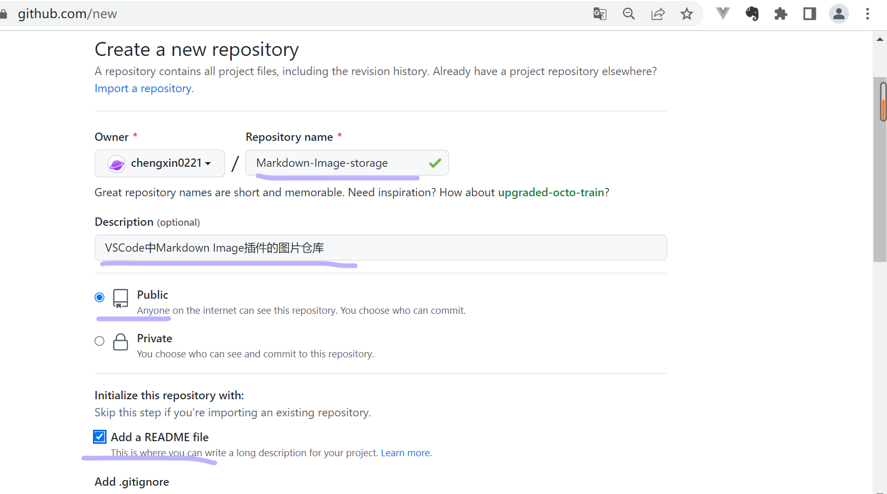
新建仓库成功
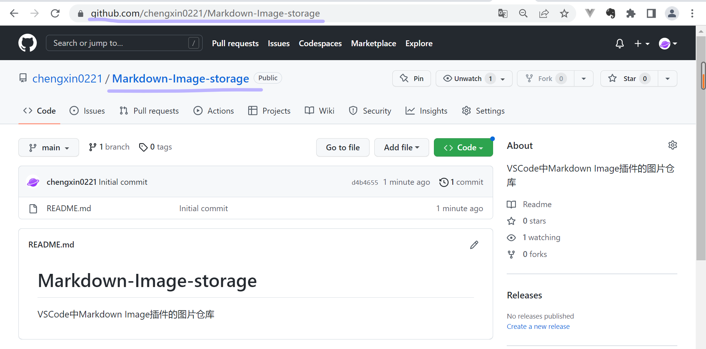

### 3.2 生成token

点击头像旁边的小三角，选择==Settings==
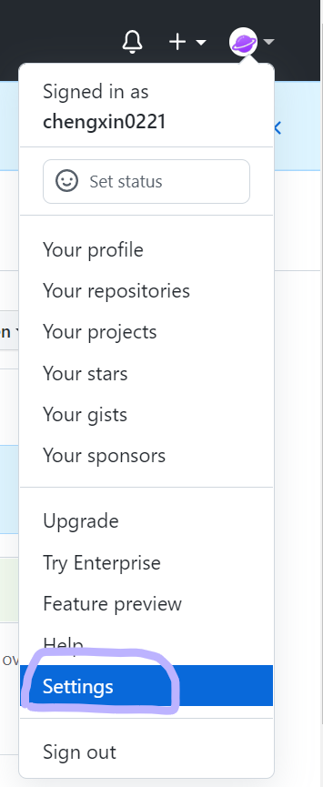
找到developer settings
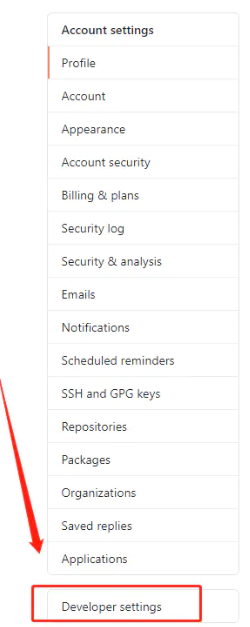
选择personal access tokens中的Tokens(classic)，点击Generate access token新建token
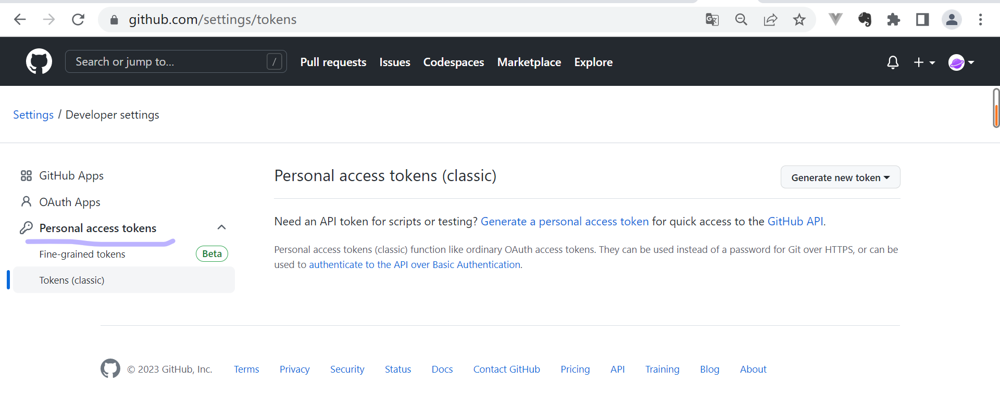
创建新的Personal access tokens，Note随便写，Expiration时间设置为永不过期，给repo权限就可以了
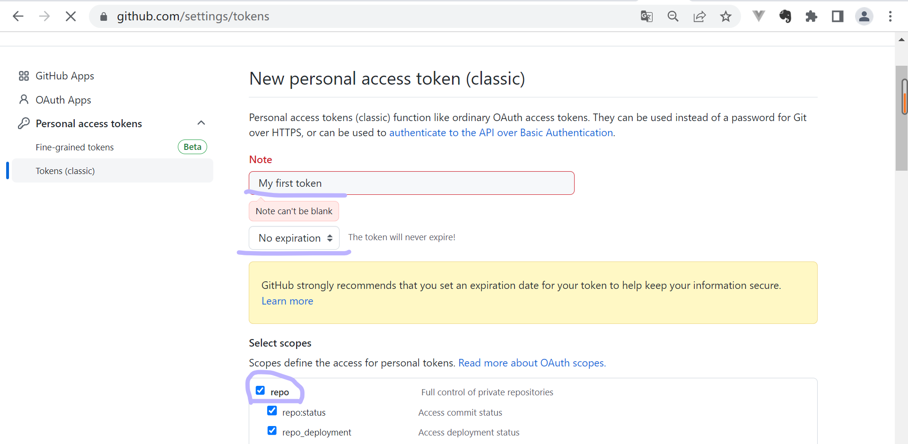
生成的Token要记下来，只显示一次
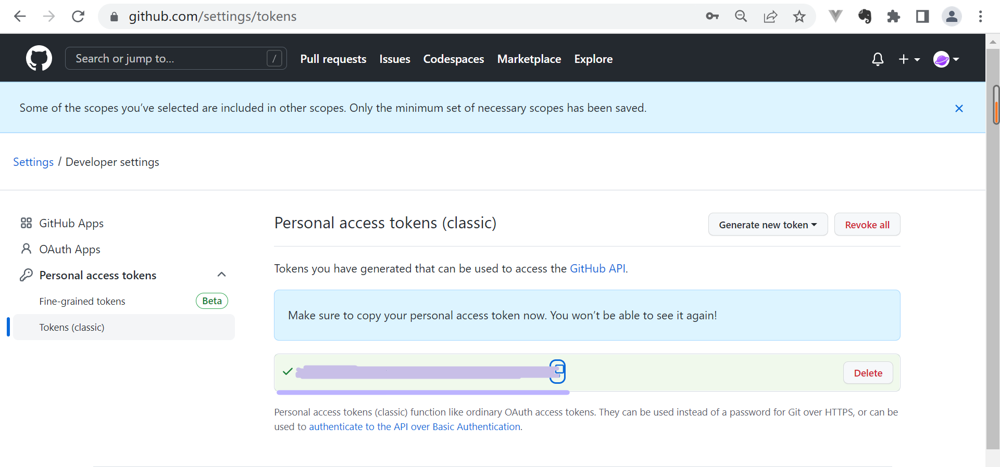

### 3.3 GitHub配置项目

打开配置 ---》 输入 Markdown Image 即可看到该插件的配置
选择GitHub上传方式：
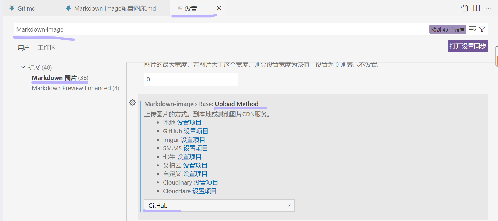
配置存放图片的仓库分支为main主分支，Cdn不需要修改，使用默认值就可以，配置仓库中存放图片的目录：
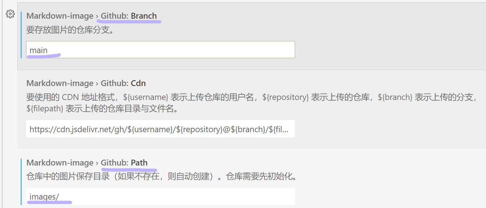
配置目的仓库地址和GitHub访问令牌Token：
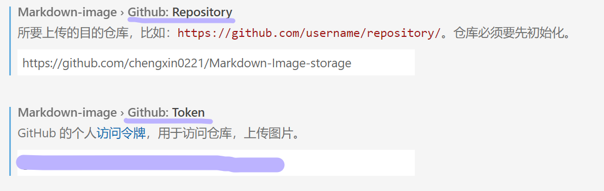
配置好之后就可以在.md文件中通过右键选择粘贴图片，或使用快捷键Shift+Alt+V插入图片了。
